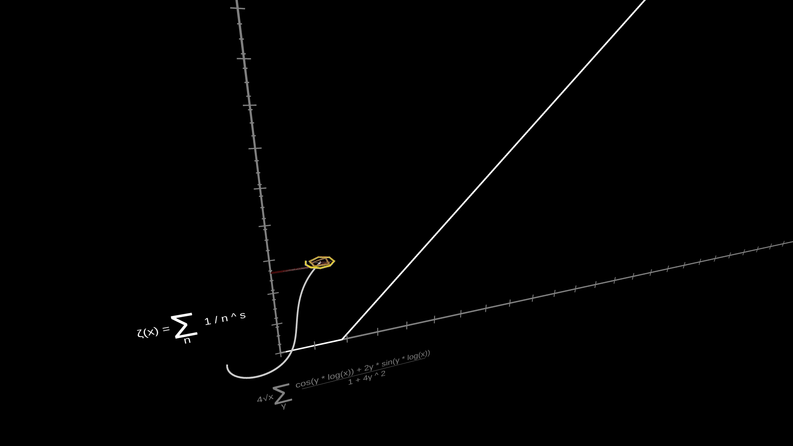
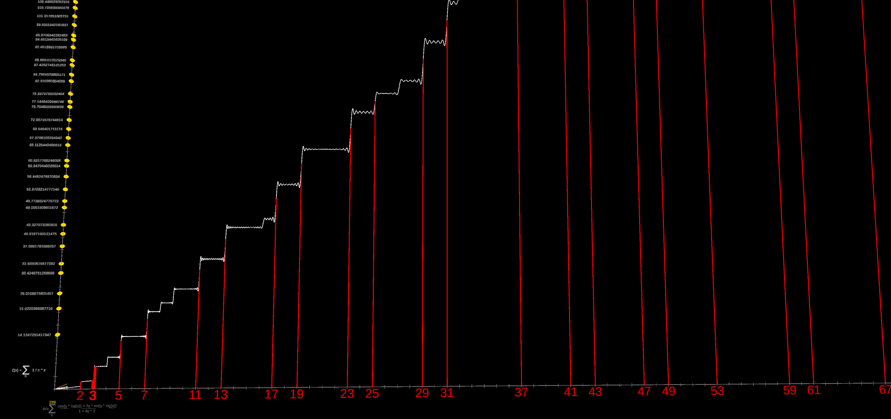

This is a Unity application for graphing the Riemann Zeta function along the critical strip at 1/2, and feeding the non-trivial Zeta Zero outputs into the Prime Counting function.

The Riemann Zeta function is given by:  
`ζ(x) = Σ 1 / n ^ s`

The Prime Counting function is approximated by:  
`4√x Σ cos(γ * log(x)) + 2γ * sin(γ * log(x)) / 1 + 4γ ^ 2`

An animation of the Zeta function is shown below. The Zeta curve spirals and intersects with the axis, resulting in Zeta Zeros (yellow dots). These values are fed into the Prime Counting function to the right. 

When enough non-trivial Zeta Zero values are provided to the Prime Counting function, prime numbers can be inferred from the large verticle steps in the graph.

The Zeta function is a composite of line segments whose segment lengths are determined by the limit of the real component of `s`, and whose rotation values are determined by the limit of the imaginary component of `s`. In the animation below, each segment is graphed in a color-coded spiral to show how the values sum together. 

There are other tools built into this animation to help break down and visualize how these mysterious functions work.

References:  
https://medium.com/cantors-paradise/the-riemann-hypothesis-explained-fa01c1f75d3f  
https://en.wikipedia.org/wiki/Explicit_formulae_for_L-functions  
https://github.com/danielhutama/Riemann-Explicit-Formula-for-Primes  
3Blue1Brown:  
https://youtu.be/sD0NjbwqlYw  